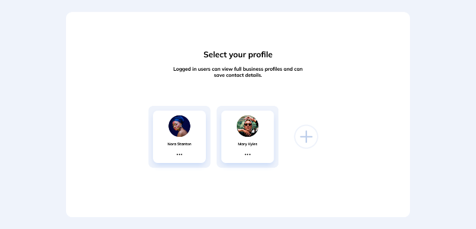

# UI Design Daily - Select Account

This is a select account example based on the [Select Account](https://www.uidesigndaily.com/posts/figma-select-account-card-section-day-1464) design from [UI Design Daily](https://www.uidesigndaily.com/).

## Table of contents

-   [Overview](#overview)
    -   [Screenshot](#screenshot)
    -   [Links](#links)
-   [My process](#my-process)
    -   [Built with](#built-with)
    -   [Continued development](#continued-development)
    -   [Useful resources](#useful-resources)
-   [Author](#author)

## Overview

### Screenshot

### Links

<!-- -   [Codepen](https://your-solution-url.com) -->

-   [Github Pages](https://javieer57.github.io/select-account-ui-practice/)

## My process

### Built with

-   [Feather Icons](https://feathericons.com/)
-   [Google Fonst](https://fonts.google.com/)
-   [Gulp](https://gulpjs.com/) - JS toolkit
-   [Normalize](https://necolas.github.io/normalize.css/)
-   [SASS](https://sass-lang.com/) - CSS preprocessor
-   CSS custom properties
-   CSS Grid
-   Flexbox
-   Javascript
-   Semantic HTML5 markup

### Continued development

I'll like to implement accessibility to this project (e.g. aria-collapse, aria-hidden). I know this is an important aspect of the web and I'll like to develop this skill for future projects.

### Useful resources

-   [How TO - Clickable Dropdown](https://www.w3schools.com/howto/howto_js_dropdown.asp) - This helped me to create de dropdown button.

## Author

-   Frontend Mentor - [@Javieer57](https://www.frontendmentor.io/profile/Javieer57)
-   Github - [@Javieer57](https://github.com/Javieer57)
-   Codepen - [@Javieer57](https://codepen.io/Javieer57)
-   Instagram - [@javieer_eufracio](https://www.instagram.com/javieer_eufracio/)
